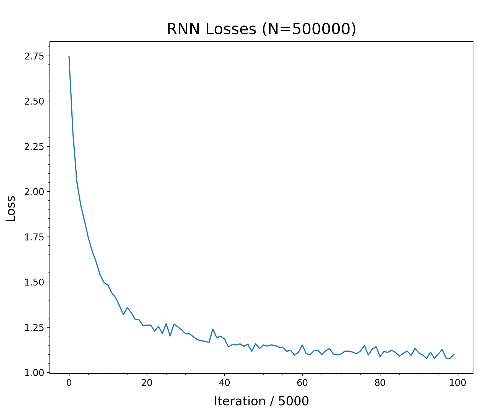
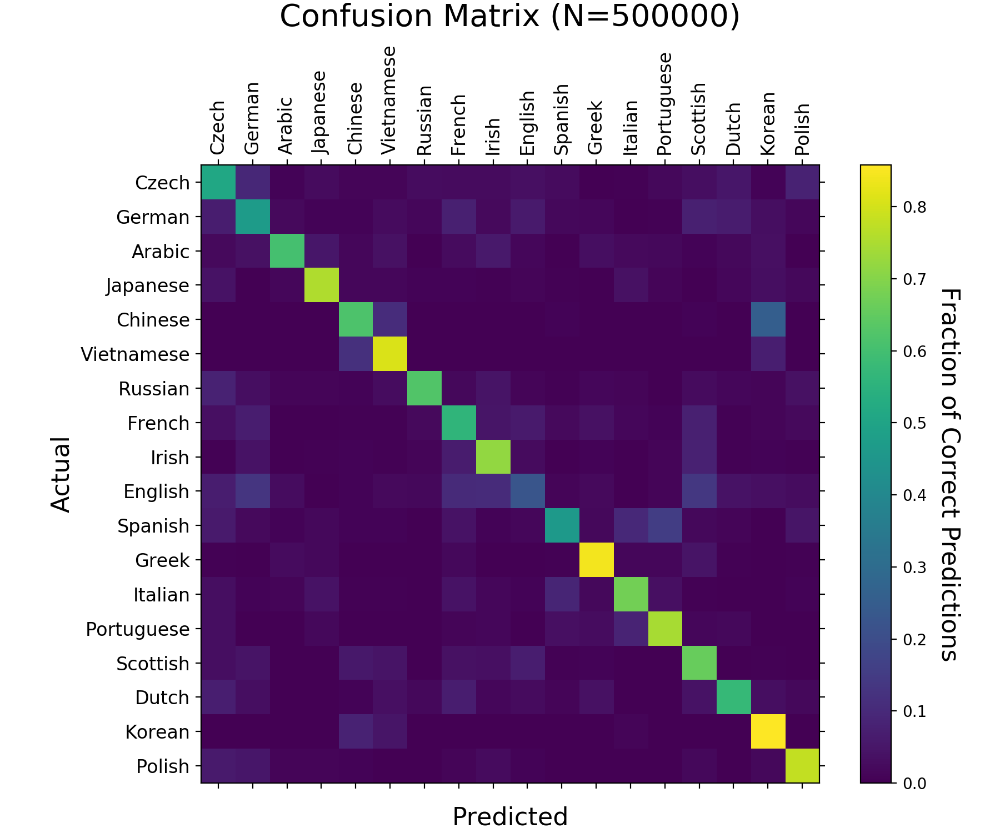

# namelang
An example Recurrent Neural Network (RNN) that predicts the language origin of a family name.

I adapted this example from the PyTorch tutorial "NLP FROM SCRATCH: CLASSIFYING NAMES WITH A CHARACTER-LEVEL RNN" by Sean Robertson.
I rewrote the code line-by-line to ensure that I understood how it all worked.
I have included a substantial number of notes and references as comments within the .py files.

Reference(s):
1. https://pytorch.org/tutorials/intermediate/char_rnn_classification_tutorial.html
1. https://blog.floydhub.com/a-beginners-guide-on-recurrent-neural-networks-with-pytorch/

The training data set is available at https://download.pytorch.org/tutorial/data.zip

## What you need to run it:

At a minimum, you need:

1. **namelang.py** - this is the script to actually read a name amkae a prediction (see Example below)
1. **namelang_data.py**, **namelang_model.py** - namelang.py uses functions defined in these scripts
1. **namelang_rnn_trained_500K.pth** - this is a saved state of the RNN that was trained over 500,000 iterations.

In order to retrain the RNN, you also need:

1. **namelang_train.py** - this is the script that trains the RNN. The number of iterations is set near the top (n_iters) and must be edited in the script to change the value. It is currently set to 500,000. By default, it saves the trained model as a file called namelang_rnn_trained.pth, which can be renamed as desired. The trained RNN used by namelang.py is defined in that script (rnn).
1. **data.zip** - this archive contains the training data set (see URL above), which should be expanded into a directory called "data" before running namelang_train.py.

Note that this RNN can be repurposed as a general use classifier by training it on different (text-based) training data.

## Other files included here:

1. **data/** - directory containing the unpacked contents of data.zip; 18 files, each corresponding to a different language, and containing a list of ground-truth names.
1. **Figure_1_500K.png** - visualization of the RNN losses for the 500,000 iteration training. Decreasing losses at increasing iterations indicates that the RNN is successfully learning.
</img>
1. **Figure_2_500K.png** - visualization of the confusion matrix for the 500,000 iteration training. 1:1 correspondence between languages on the x- and y-axes indicates successful training of the RNN, while the presence of lighter-colored squares utisde the 1:1 line indicates possibly probelmatic predictions (for example, there is a reasonably high probability that the RNN could have trouble correctly identifying Spanish and Portugese, or Korean and Chinese).
</img>

## Example:

% python namelang.py Schmidt
 
Language Origin (Probability):
  1. German (0.58)
  2. French (0.21)
  3. Scottish (0.10)
